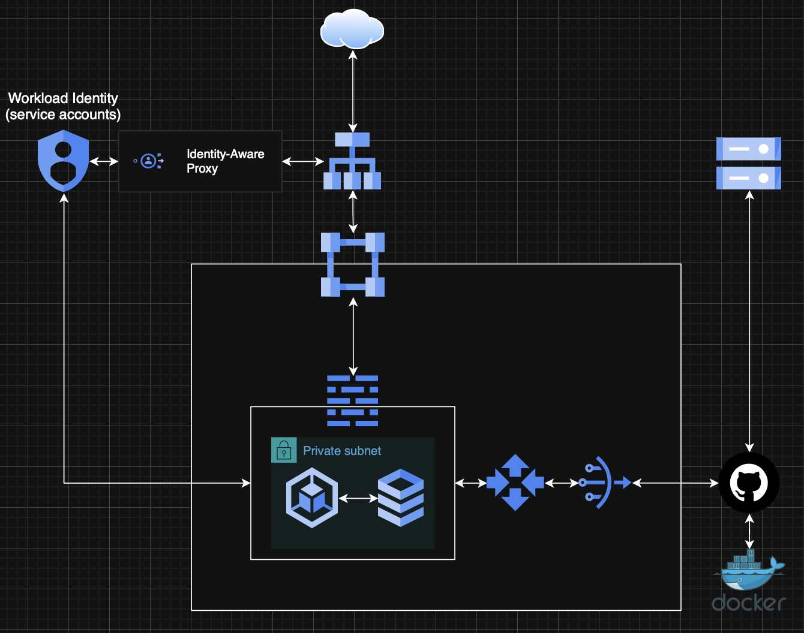

# High Availability HRM GitOps Platform

An enterprise-grade, Zero Trust GitOps platform built on Google Cloud Platform. The system automates employee lifecycle management — provisioning isolated, containerised workspaces on onboarding and tearing them down on offboarding, with no manual intervention required.

## Overview

When HR creates an employee, a FastAPI backend calls a Cloud Function which commits a workspace manifest to this repository. ArgoCD detects the commit and spins up an isolated Kubernetes pod for that employee running a browser-based VS Code IDE. When HR offboards the employee, the manifest is deleted from git and ArgoCD destroys the pod. Git is the single source of truth at every layer.

## Network Diagram



## Architecture

```
User
 └─► GCP Load Balancer (auto-created by GKE Ingress)
      └─► Identity-Aware Proxy (Google IAM enforcement)
           └─► Global VPC — Private Subnet (europe-west4)
                ├─► GKE Standard Cluster (Private Nodes)
                │    ├─► hrm namespace          (FastAPI app + frontend + Cloud SQL proxy)
                │    ├─► software namespace      (employee workspaces — no DB access)
                │    ├─► devops namespace         (employee workspaces — DB read access)
                │    └─► db-engineering namespace (employee workspaces — full DB access)
                │         └─► Workload Identity ──► Cloud SQL PostgreSQL 15 (Regional HA)
                └─► Cloud Router ──► Cloud NAT ──► Internet (GitHub / Artifact Registry)

CI/CD:    GitHub Actions ──► Workload Identity Federation (OIDC) ──► GCP APIs
GitOps:   HR Action ──► FastAPI ──► Cloud Function ──► GitHub commit ──► ArgoCD ──► Pod
```

## Tech Stack

| Layer | Technology |
|---|---|
| Cloud | GCP — europe-west4 |
| IaC | Terraform + Terragrunt |
| GitOps | ArgoCD |
| Orchestration | GKE Standard (Private Cluster) |
| Database | Cloud SQL PostgreSQL 15 (Regional HA) |
| Application | FastAPI + plain HTML/JS frontend |
| Serverless | Cloud Functions Gen 2 (Python 3.11) |
| State Backend | GCS with native locking |
| CI/CD Auth | Workload Identity Federation (OIDC) |
| Ingress Auth | Identity-Aware Proxy (IAP) |
| Container Registry | Artifact Registry |
| Monitoring | Cloud Monitoring — uptime checks, alert policies, dashboard |

## Repository Structure

```
.
├── global/bootstrap/        # Run once locally — GCS bucket + WIF pool + CI/CD SA
├── modules/                 # Reusable Terraform modules (no state)
│   ├── networking/          # VPC, Subnets, NAT, Firewall rules
│   ├── cluster/             # GKE Standard cluster + Node pool
│   ├── storage/             # Cloud SQL HA + Artifact Registry + DB role init
│   ├── security/            # Service Accounts, IAP, Workload Identity, dept SAs
│   ├── functions/           # Cloud Function + Python source code
│   └── monitoring/          # Uptime checks, alert policies, dashboard
├── env/dev/                 # Terragrunt configs — owns Terraform state
│   ├── terragrunt.hcl       # Root — shared locals, provider, GCS backend
│   ├── networking/
│   ├── gke/
│   ├── storage/
│   ├── security/
│   ├── functions/
│   └── monitoring/
├── k8s/
│   ├── argocd/              # ArgoCD AppProject + Application manifests
│   ├── apps/
│   │   ├── hrm/             # Core HRM Helm chart (deployment, ingress, IAP)
│   │   └── departments/     # Department namespace infrastructure (plain manifests)
│   └── workspaces/          # Auto-generated per-employee workspace manifests
│       └── _template/       # Reference template (rendered by Cloud Function)
├── hrm-app/                 # FastAPI application + HTML frontend + Dockerfile
└── .github/workflows/
    ├── deploy.yml           # Infrastructure + workspace images (triggers on env/** modules/**)
    ├── build-images.yml     # HRM app image only (triggers on hrm-app/**)
    └── destroy.yml          # Manual teardown with confirmation
```

## Workflows

| Workflow | Trigger | What it does |
|---|---|---|
| `deploy.yml` | Push to `main` — `env/**` or `modules/**` | Terragrunt apply + workspace image push + ArgoCD setup + k8s secrets |
| `build-images.yml` | Push to `main` — `hrm-app/**` | Build + push HRM app Docker image |
| `destroy.yml` | Manual — type `Destroy` to confirm | Disable deletion protection + full teardown |

## Prerequisites

- GCP project with billing enabled
- `gcloud` CLI authenticated locally
- `terraform` >= 1.5
- `terragrunt` >= 0.55
- GitHub repository with Actions enabled

## Deployment

See [INTEGRATION.md](./INTEGRATION.md) for the full step-by-step deployment guide including bootstrap, WIF setup, GitHub PAT configuration, pipeline secrets and variables, and post-deploy steps.

## Security Model

- **Zero Trust ingress** — IAP enforces Google IAM before any traffic enters the VPC
- **No static credentials** — WIF for CI/CD, Workload Identity for pods, Secret Manager for all secrets
- **Private cluster** — GKE nodes have no public IPs; control plane protected by `master_authorized_networks_config`
- **Namespace isolation** — each department has dedicated NetworkPolicy, ResourceQuota, and Service Account
- **Least privilege** — dedicated SA per component; `iam_member` (additive) never `iam_binding` (authoritative)
- **Default deny networking** — all pod-level traffic blocked unless explicitly permitted by NetworkPolicy

## Onboarding Flow

```
HR fills in employee form (frontend)
    ↓
FastAPI backend inserts employee record to Cloud SQL
    ↓
Backend calls Cloud Function (POST /onboard)
    ↓
Function generates random workspace password
    ↓
Function commits workspace.yaml + secret.yaml to k8s/workspaces/DEPT/EMP_ID/
    ↓
ArgoCD ApplicationSet detects new directory
    ↓
Pod + Secret created in department namespace
    ↓
Employee accesses code-server IDE via IAP-protected URL
```

## Offboarding Flow

```
HR clicks offboard (frontend)
    ↓
FastAPI soft-deletes employee record (status = offboarded, kept for audit)
    ↓
Backend calls Cloud Function (POST /offboard)
    ↓
Function deletes k8s/workspaces/DEPT/EMP_ID/ from git
    ↓
ArgoCD detects deletion (prune: true)
    ↓
Pod + Secret destroyed — all access revoked
```

## Department Access Model

| Department | Cloud SQL | PostgreSQL Role | Workspace Image |
|---|---|---|---|
| Software | No direct access | None | code-server |
| DevOps | Via Auth Proxy | `devops_readonly` (SELECT) | code-server |
| DB Engineering | Via Auth Proxy + sidecar | `db_engineer` (full) | code-server |

## Monitoring

Three alert policies send email notifications to the configured owner address:
- **HRM app down** — uptime check fails for 120s
- **Cloud SQL CPU > 80%** — sustained for 5 minutes
- **GKE node memory > 85%** — sustained for 5 minutes

A Cloud Monitoring dashboard provides real-time visibility into GKE CPU/memory and Cloud SQL CPU/connections.
